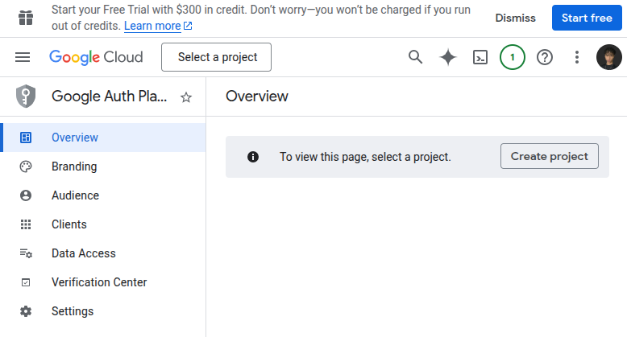
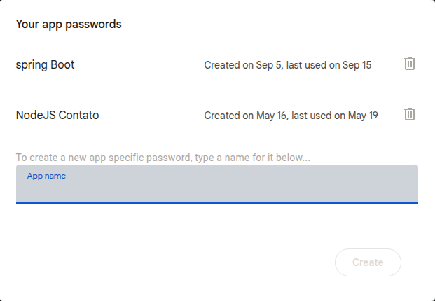

# 🛒 GestPro - Sistema de Gestão para Mercados e Lojas

**GestPro** é um sistema completo de gestão para mercados e lojas, desenvolvido com **Next.js 14+** (frontend) e **Spring Boot 3** (backend).  
O sistema inclui login, cadastro, recuperação de senha, dashboard, controle de produtos, estoque, vendas, clientes e relatórios.

---

## 🚀 Tecnologias

### Frontend
- Next.js 14+ (App Router)
- TypeScript
- Tailwind CSS
- shadcn/ui
- Lucide Icons

### Backend
- Java 17+
- Spring Boot 3.x
- Spring Security + JWT
- OAuth2 (Login com Google)
- MySQL 8+
- Maven

---

## 📂 Estrutura do Repositório

```bash
GestPro/
├── frontend/      # Interface do usuário (Next.js)
├── backend/       # API e regras de negócio (Spring Boot)
└── README.md      # Este arquivo
```
Cada pasta possui seu próprio README detalhado com instruções de configuração, execução e screenshots.

Screenshots do Sistema

Login
---


Dashboard
---


🔐 Funcionalidades Principais
```
Cadastro e login de usuários (email/senha e Google OAuth2)

Recuperação e redefinição de senha

Controle de acesso por TipoPlano (EXPERIMENTAL / ASSINANTE)

Status de usuário (ATIVO / INATIVO)

Dashboard com informações do usuário

Backend totalmente integrado com frontend Next.js
```
📡 Links Úteis

[Frontend README](https://github.com/MartnsDev/Gest-Pro/tree/2ced41f10df3341faa91cdcd0596061cfdcbc920/FrontEnd) 
[Backend README](https://github.com/MartnsDev/Gest-Pro/tree/2ced41f10df3341faa91cdcd0596061cfdcbc920/Backend)

🧩 Próximos Passos
```
Implementar módulos de Produtos, Estoque, Vendas, Clientes e Relatórios

Adicionar testes unitários e de integração

Implementar notificações em tempo real

Suporte a múltiplas lojas
```

# Como baixar e executar o projeto

Este guia mostra como clonar o projeto e configurar corretamente as variáveis de ambiente **no Windows e no Linux**, para que o Spring Boot consiga iniciar sem erros.

---

## 1 Clonar o repositório

Abra o terminal ou prompt de comando e execute:

```bash
git clone https://github.com/MartnsDev/Gest-Pro.git
```

Depois disso, entre na pasta do projeto e abra na sua IDE. Configuração das variáveis de ambiente
O projeto utiliza variáveis de ambiente para segurança e organização, evitando dados sensíveis no código.

No application.properties essas variáveis já estão referenciadas assim:

properties
```
# ===============================
# BANCO DE DADOS
# ===============================
spring.datasource.url=${DB_URL}
spring.datasource.username=${DB_USERNAME}
spring.datasource.password=${DB_PASSWORD}
spring.datasource.driver-class-name=com.mysql.cj.jdbc.Driver

# ===============================
# SERVIDOR
# ===============================
server.port=${SERVER_PORT}
app.base-url=${APP_BASE_URL}

# ===============================
# JPA / HIBERNATE
# ===============================
spring.jpa.hibernate.ddl-auto=${JPA_HBM_DDL}
spring.jpa.show-sql=${JPA_SHOW_SQL}
spring.jpa.properties.hibernate.format_sql=${JPA_FORMAT_SQL}
spring.jpa.open-in-view=${JPA_OPEN_IN_VIEW}

# ===============================
# Swagger
# ===============================
springdoc.api-docs.path=${SWAGGER_API_DOCS_PATH}
springdoc.swagger-ui.path=${SWAGGER_UI_PATH}

# ===============================
# JWT
# ===============================
jwt.secret=${JWT_SECRET}
app.jwt-expiration-ms=${JWT_EXPIRATION}

# ===============================
# BASIC AUTH (TESTES)
# ===============================
spring.security.user.name=${BASIC_AUTH_USER}
spring.security.user.password=${BASIC_AUTH_PASSWORD}
spring.security.user.roles=${BASIC_AUTH_ROLE}

# ===============================
# OAuth2 Google
# ===============================
spring.security.oauth2.client.registration.google.client-id=${GOOGLE_CLIENT_ID}
spring.security.oauth2.client.registration.google.client-secret=${GOOGLE_CLIENT_SECRET}
spring.security.oauth2.client.registration.google.scope=${GOOGLE_SCOPE}
spring.security.oauth2.client.registration.google.redirect-uri=${GOOGLE_REDIRECT_URI}
spring.security.oauth2.client.provider.google.authorization-uri=${GOOGLE_AUTH_URI}
spring.security.oauth2.client.provider.google.token-uri=${GOOGLE_TOKEN_URI}
spring.security.oauth2.client.provider.google.user-info-uri=${GOOGLE_USERINFO_URI}
spring.security.oauth2.client.provider.google.user-name-attribute=${GOOGLE_USERNAME_ATTR}

# ===============================
# Email Sender
# ===============================
spring.mail.host=${MAIL_HOST}
spring.mail.port=${MAIL_PORT}
spring.mail.username=${MAIL_USERNAME}
spring.mail.password=${MAIL_PASSWORD}
spring.mail.properties.mail.smtp.auth=${MAIL_SMTP_AUTH}
spring.mail.properties.mail.smtp.starttls.enable=${MAIL_SMTP_STARTTLS}

# ===============================
# Otimização
# ===============================
spring.main.lazy-initialization=false
spring.redis.host=localhost
spring.redis.port=6379
spring.devtools.restart.enabled=false
```
Agora vamos configurar essas variáveis no sistema operacional.

3 Configurando variáveis de ambiente no Windows
Opção 1 Usando o terminal (temporário)
Abra o Prompt de Comando ou PowerShell e execute:

powershell
```
setx DB_URL "jdbc:mysql://localhost:3306/gestpro_db"
setx DB_USERNAME "root"
setx DB_PASSWORD "senha_do_banco"

setx SERVER_PORT "8080"
setx APP_BASE_URL "http://localhost:8080"

setx JPA_HBM_DDL "update"
setx JPA_SHOW_SQL "true"
setx JPA_FORMAT_SQL "true"
setx JPA_OPEN_IN_VIEW "false"

setx SWAGGER_API_DOCS_PATH "/v3/api-docs"
setx SWAGGER_UI_PATH "/swagger-ui.html"

setx JWT_SECRET "sua_chave_secreta_jwt"
setx JWT_EXPIRATION "86400000"

setx BASIC_AUTH_USER "admin"
setx BASIC_AUTH_PASSWORD "admin"
setx BASIC_AUTH_ROLE "ADMIN"

setx GOOGLE_CLIENT_ID "seu_client_id"
setx GOOGLE_CLIENT_SECRET "seu_client_secret"
setx GOOGLE_SCOPE "openid,email,profile"
setx GOOGLE_REDIRECT_URI "http://localhost:8080/login/oauth2/code/google"
setx GOOGLE_AUTH_URI "https://accounts.google.com/o/oauth2/v2/auth"
setx GOOGLE_TOKEN_URI "https://oauth2.googleapis.com/token"
setx GOOGLE_USERINFO_URI "https://www.googleapis.com/oauth2/v3/userinfo"
setx GOOGLE_USERNAME_ATTR "sub"

setx MAIL_HOST "smtp.gmail.com"
setx MAIL_PORT "587"
setx MAIL_USERNAME "seu_email@gmail.com"
setx MAIL_PASSWORD "senha_de_app"
setx MAIL_SMTP_AUTH "true"
setx MAIL_SMTP_STARTTLS "true"
```
Após isso, feche e abra o terminal novamente, pois o Windows só aplica as variáveis em novas sessões.

Opção 2 Variáveis permanentes pelo sistema
Você também pode configurar pelo caminho:

Painel de Controle
Sistema
Configurações avançadas do sistema
Variáveis de ambiente

Crie cada variável manualmente com o mesmo nome e valor acima.

4 Configurando variáveis de ambiente no Linux
No Linux, o mais comum é usar o .bashrc, .zshrc ou .profile.

Abra o terminal e edite o arquivo:

```
nano ~/.bashrc
```
Ou, se usar zsh:
```
nano ~/.zshrc
```
Adicione no final do arquivo:
```
export DB_URL="jdbc:mysql://localhost:3306/gestpro_db"
export DB_USERNAME="root"
export DB_PASSWORD="senha_do_banco"

export SERVER_PORT="8080"
export APP_BASE_URL="http://localhost:8080"

export JPA_HBM_DDL="update"
export JPA_SHOW_SQL="true"
export JPA_FORMAT_SQL="true"
export JPA_OPEN_IN_VIEW="false"

export SWAGGER_API_DOCS_PATH="/v3/api-docs"
export SWAGGER_UI_PATH="/swagger-ui.html"

export JWT_SECRET="sua_chave_secreta_jwt"
export JWT_EXPIRATION="86400000"

export BASIC_AUTH_USER="admin"
export BASIC_AUTH_PASSWORD="admin"
export BASIC_AUTH_ROLE="ADMIN"

export GOOGLE_CLIENT_ID="seu_client_id"
export GOOGLE_CLIENT_SECRET="seu_client_secret"
export GOOGLE_SCOPE="openid,email,profile"
export GOOGLE_REDIRECT_URI="http://localhost:8080/login/oauth2/code/google"
export GOOGLE_AUTH_URI="https://accounts.google.com/o/oauth2/v2/auth"
export GOOGLE_TOKEN_URI="https://oauth2.googleapis.com/token"
export GOOGLE_USERINFO_URI="https://www.googleapis.com/oauth2/v3/userinfo"
export GOOGLE_USERNAME_ATTR="sub"

export MAIL_HOST="smtp.gmail.com"
export MAIL_PORT="587"
export MAIL_USERNAME="seu_email@gmail.com"
export MAIL_PASSWORD="senha_de_app"
export MAIL_SMTP_AUTH="true"
export MAIL_SMTP_STARTTLS="true"
```
Depois salve e aplique:

```
source ~/.bashrc
```
5 Executando o projeto
Após configurar as variáveis, execute o projeto normalmente:
```
./mvnw spring-boot:run
```
Ou pela IDE.

Se tudo estiver correto, o Spring Boot iniciará sem erros de configuração.

Observação importante
Nunca versionar senhas, secrets, tokens ou credenciais no GitHub.
Sempre use variáveis de ambiente, principalmente em produção.


# Configuração OAuth2 com Google no Spring Boot

Este guia explica como obter e configurar todas as variáveis necessárias para usar login com Google OAuth2 em um projeto Spring Boot com Spring Security.

A ideia é simples. Você cria um app no Google Cloud, gera credenciais OAuth2 e conecta isso ao seu backend.

---

## Pré requisitos

Você precisa de uma conta Google e acesso ao Google Cloud Console.  
Não é necessário cartão de crédito para desenvolvimento.

Acesse:
```
htps://console.cloud.google.com
```
--

## 1 Criar um projeto no Google Cloud

No topo da tela, clique em **Selecionar projeto** e depois em **Novo projeto**.



Defina um nome, por exemplo:
```
GestPro OAuth  
ou  
GP Dev Auth  
```
Crie o projeto e selecione ele.

---

## 2 Configurar a Tela de Consentimento OAuth

No menu lateral, acesse:

APIs e serviços  
Tela de consentimento OAuth  

Selecione o tipo:

Externo  

Clique em Criar.

Preencha os campos principais:

Nome do app  
Email de suporte  

Os escopos podem ficar no padrão por enquanto.  
Salve e finalize a configuração.

Mesmo em modo de teste isso já funciona para desenvolvimento.

---

## 3 Criar as credenciais OAuth 2.0

No menu lateral, vá em:

APIs e serviços  
Credenciais  

Clique em **Criar credenciais** e escolha **ID do cliente OAuth**.

Tipo de aplicativo:

Aplicativo da Web  

### URIs de redirecionamento autorizados

Adicione exatamente esta URL:

```text
http://localhost:8080/login/oauth2/code/google
```

# Configuração de Envio de Email no Spring Boot

Este guia explica como configurar envio de emails no Spring Boot usando SMTP.  
Esse recurso é muito usado para cadastro de usuário, recuperação de senha, confirmação de conta e notificações do sistema.

A ideia aqui é simples. Seu backend se conecta a um servidor de email e envia mensagens automaticamente.

---

## Pré requisitos

Você precisa de um email que permita envio via SMTP.  
O mais comum em projetos é usar Gmail ou um serviço como Outlook, Zoho ou um serviço profissional.

Neste exemplo vou usar **Gmail**, pois é o mais comum em desenvolvimento.

---

## 1 Criar ou preparar um email para envio

Use um email dedicado para o sistema, por exemplo:
```
gestpro.app@gmail.com  
```
Evite usar seu email pessoal.

---

## 2 Ativar senha de app no Gmail

O Gmail não permite mais usar a senha normal da conta.

Você precisa criar uma **senha de app**.

Passo a passo:

Acesse:
```
https://myaccount.google.com/security
```
Ative a verificação em duas etapas na conta.

Depois disso, entre em **Senhas de app**.


Crie uma nova senha para o aplicativo.  
Nome sugerido: Spring Boot Email



O Google vai gerar uma senha parecida com:

```text
abcd efgh ijkl mnop
```

## Fluxo de emails após configurar o Email Sender

Depois que o Email Sender estiver configurado corretamente, o sistema passa a enviar emails automáticos para validação de ações importantes do usuário.

Esses emails fazem parte da segurança e da experiência do sistema.

---

## Confirmação de conta

Quando o usuário cria uma conta, o sistema envia um email contendo um **código de confirmação**.

Esse código é usado para validar que o email realmente pertence ao usuário e ativar a conta.

Exemplo do email de confirmação enviado pelo sistema:


---

## Redefinição de senha

Quando o usuário solicita a recuperação de senha, o sistema envia um **código temporário** para redefinição.

Esse código garante que apenas o dono do email consiga alterar a senha da conta.

Exemplo do email de redefinição de senha:


---

## Observação importante

Os códigos enviados por email possuem tempo de expiração e uso único, aumentando a segurança do sistema.

Esse fluxo é essencial em aplicações reais e segue o padrão utilizado em sistemas profissionais.

## Documentação Swagger
---


Cadastro
---


Redefinir Senha
---


� Licença
```
Este projeto não pode ser copiado, reproduzido ou utilizado sem autorização do autor.
Todos os direitos reservados a Matheus Martins (MartnsDev).
```

Feito com 💚 por Matheus Martins [Linkedin](https://www.linkedin.com/in/matheusmartnsdev/)
