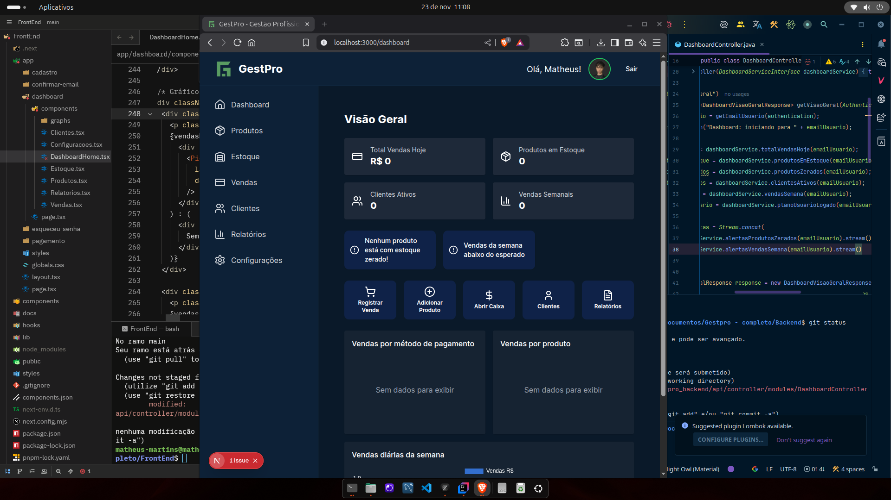
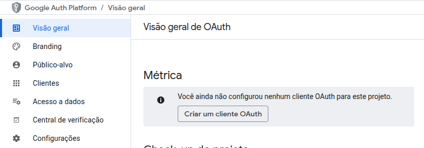
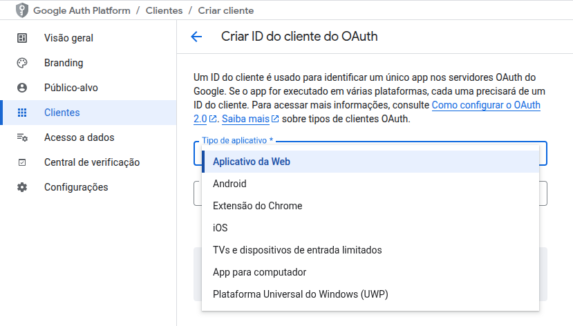

# GestPro

Sistema completo de gestão para mercados e lojas, desenvolvido com arquitetura moderna utilizando Next.js 14+ no frontend e Spring Boot 3 no backend.

[](LICENSE)

## 📋 Sobre o Projeto

GestPro é uma solução completa para gestão comercial que oferece controle de produtos, estoque, vendas, clientes e relatórios através de uma interface intuitiva e moderna.

### Principais Funcionalidades

- **Autenticação completa**: Login com email/senha e OAuth2 (Google)
- **Gestão de usuários**: Cadastro, recuperação de senha e confirmação por email
- **Controle de acesso**: Sistema de planos (EXPERIMENTAL/ASSINANTE) e status de usuário
- **Dashboard**: Visão geral e atalhos rápidos para funcionalidades principais
- **Gestão comercial**: Produtos, estoque, vendas e clientes
- **Relatórios**: Análises e indicadores de performance

## 📸 Interface do Sistema

<table>
  <tr>
    <td width="50%">
      <h3 align="center">Tela de Login</h3>
      
      <p align="center">Login com email/senha ou Google OAuth2</p>
    </td>
    <td width="50%">
      <h3 align="center">Cadastro de Usuário</h3>
      
      <p align="center">Cadastro com validação de email</p>
    </td>
  </tr>
  <tr>
    <td width="50%">
      <h3 align="center">Recuperação de Senha</h3>
      
      <p align="center">Reset de senha via email</p>
    </td>
    <td width="50%">
      <h3 align="center">Dashboard Principal</h3>
      
      <p align="center">Visão geral do negócio</p>
    </td>
  </tr>
</table>

## 🚀 Tecnologias

### Frontend
- **Next.js 14+** com App Router
- **TypeScript**
- **Tailwind CSS** para estilização
- **shadcn/ui** como biblioteca de componentes
- **Lucide Icons**

### Backend
- **Java 17+**
- **Spring Boot 3.x**
- **Spring Security** com autenticação JWT
- **OAuth2** para login social (Google)
- **MySQL 8+**
- **Redis** para caching
- **Maven** para gerenciamento de dependências
- **Swagger** para documentação da API

## 📂 Estrutura do Repositório

```
GestPro/
├── frontend/          # Aplicação Next.js
├── backend/           # API Spring Boot
├── Img/               # Assets do README
└── README.md
```

## 🚀 Quick Start

### Pré-requisitos

- **Java 17+**
- **Node.js 18+**
- **MySQL 8+**
- **Redis** (opcional, para caching)
- **Maven** (incluído no projeto)

### Instalação Rápida

```bash
# 1. Clone o repositório
git clone https://github.com/MartnsDev/Gest-Pro.git
cd GestPro

# 2. Configure as variáveis de ambiente (ver seção abaixo)

# 3. Crie o banco de dados
mysql -u root -p -e "CREATE DATABASE gestpro_db;"

# 4. Inicie o backend
cd backend
./mvnw spring-boot:run

# 5. Em outro terminal, inicie o frontend
cd frontend
npm install
npm run dev
```

**Acesse:**
- Frontend: `http://localhost:3000`
- Backend API: `http://localhost:8080`
- Swagger: `http://localhost:8080/swagger-ui.html`

---

## ⚙️ Configuração Detalhada

### Variáveis de Ambiente

O projeto utiliza variáveis de ambiente para todas as configurações sensíveis. **Nunca commit credenciais no código.**

### Configuração no Windows

Use PowerShell para definir as variáveis de ambiente:
```powershell
# Database
setx DB_URL "jdbc:mysql://localhost:3306/gestpro_db"
setx DB_USERNAME "root"
setx DB_PASSWORD "sua_senha"

# Server
setx SERVER_PORT "8080"
setx APP_BASE_URL "http://localhost:8080"

# JPA/Hibernate
setx JPA_HBM_DDL "update"
setx JPA_SHOW_SQL "true"
setx JPA_FORMAT_SQL "true"
setx JPA_OPEN_IN_VIEW "false"

# Swagger
setx SWAGGER_API_DOCS_PATH "/v3/api-docs"
setx SWAGGER_UI_PATH "/swagger-ui.html"

# JWT
setx JWT_SECRET "sua_chave_secreta_jwt_minimo_256_bits"
setx JWT_EXPIRATION "86400000"

# Basic Auth
setx BASIC_AUTH_USER "admin"
setx BASIC_AUTH_PASSWORD "admin"
setx BASIC_AUTH_ROLE "ADMIN"

# OAuth2 Google (ver seção OAuth2)
setx GOOGLE_CLIENT_ID "seu_client_id"
setx GOOGLE_CLIENT_SECRET "seu_client_secret"
setx GOOGLE_SCOPE "openid,email,profile"
setx GOOGLE_REDIRECT_URI "http://localhost:8080/login/oauth2/code/google"
setx GOOGLE_AUTH_URI "https://accounts.google.com/o/oauth2/v2/auth"
setx GOOGLE_TOKEN_URI "https://oauth2.googleapis.com/token"
setx GOOGLE_USERINFO_URI "https://www.googleapis.com/oauth2/v3/userinfo"
setx GOOGLE_USERNAME_ATTR "sub"

# Email (ver seção Email)
setx MAIL_HOST "smtp.gmail.com"
setx MAIL_PORT "587"
setx MAIL_USERNAME "seu_email@gmail.com"
setx MAIL_PASSWORD "senha_de_app_google"
setx MAIL_SMTP_AUTH "true"
setx MAIL_SMTP_STARTTLS "true"
```

**Observação:** Feche e reabra o terminal para aplicar as variáveis.

---

### Configuração no Linux/macOS

Edite o arquivo de configuração do shell:

```bash
nano ~/.bashrc  # ou ~/.zshrc se usar zsh
```

Adicione as seguintes variáveis:

```bash
# Database
export DB_URL="jdbc:mysql://localhost:3306/gestpro_db"
export DB_USERNAME="root"
export DB_PASSWORD="sua_senha"

# Server
export SERVER_PORT="8080"
export APP_BASE_URL="http://localhost:8080"

# JPA/Hibernate
export JPA_HBM_DDL="update"
export JPA_SHOW_SQL="true"
export JPA_FORMAT_SQL="true"
export JPA_OPEN_IN_VIEW="false"

# Swagger
export SWAGGER_API_DOCS_PATH="/v3/api-docs"
export SWAGGER_UI_PATH="/swagger-ui.html"

# JWT
export JWT_SECRET="sua_chave_secreta_jwt_minimo_256_bits"
export JWT_EXPIRATION="86400000"

# Basic Auth
export BASIC_AUTH_USER="admin"
export BASIC_AUTH_PASSWORD="admin"
export BASIC_AUTH_ROLE="ADMIN"

# OAuth2 Google
export GOOGLE_CLIENT_ID="seu_client_id"
export GOOGLE_CLIENT_SECRET="seu_client_secret"
export GOOGLE_SCOPE="openid,email,profile"
export GOOGLE_REDIRECT_URI="http://localhost:8080/login/oauth2/code/google"
export GOOGLE_AUTH_URI="https://accounts.google.com/o/oauth2/v2/auth"
export GOOGLE_TOKEN_URI="https://oauth2.googleapis.com/token"
export GOOGLE_USERINFO_URI="https://www.googleapis.com/oauth2/v3/userinfo"
export GOOGLE_USERNAME_ATTR="sub"

# Email
export MAIL_HOST="smtp.gmail.com"
export MAIL_PORT="587"
export MAIL_USERNAME="seu_email@gmail.com"
export MAIL_PASSWORD="senha_de_app_google"
export MAIL_SMTP_AUTH="true"
export MAIL_SMTP_STARTTLS="true"
```

Aplique as alterações:

```bash
source ~/.bashrc  # ou source ~/.zshrc
```

---

## 🔐 Configurações Adicionais

### OAuth2 - Login com Google

Para habilitar o login com Google, siga os passos abaixo:

#### 1. Criar Projeto no Google Cloud Console

Acesse o [Google Cloud Console](https://console.cloud.google.com) e crie um novo projeto:


#### 2. Configurar OAuth Consent Screen

- No menu lateral, acesse **APIs e serviços → Tela de consentimento OAuth**
- Selecione tipo: **Externo**
- Preencha nome do aplicativo e email de suporte



#### 3. Criar Credenciais OAuth 2.0

- Acesse **Credenciais → Criar credenciais → ID do cliente OAuth**
- Tipo de aplicativo: **Aplicativo da Web**



#### 4. Configurar URI de Redirecionamento

Adicione a seguinte URI autorizada:
```
http://localhost:8080/login/oauth2/code/google
```

#### 5. Copiar Credenciais

Após criar, copie o **Client ID** e **Client Secret** e configure nas variáveis de ambiente:

```bash
GOOGLE_CLIENT_ID="seu_client_id_aqui"
GOOGLE_CLIENT_SECRET="seu_client_secret_aqui"
```

---

### Envio de Email via SMTP (Gmail)

O sistema utiliza email para confirmação de cadastro e recuperação de senha.

#### 1. Ativar Verificação em Duas Etapas

Acesse [Google Account Security](https://myaccount.google.com/security) e ative a verificação em duas etapas.

#### 2. Gerar Senha de Aplicativo


Acesse **Senhas de app** e crie uma nova senha:


#### 3. Configurar Variáveis de Ambiente

Use a senha gerada (16 caracteres) na variável `MAIL_PASSWORD`:

```bash
MAIL_USERNAME="seu_email@gmail.com"
MAIL_PASSWORD="xxxx xxxx xxxx xxxx"  # Senha de app gerada
```

#### Funcionalidades de Email Implementadas

**Confirmação de Cadastro:**


O usuário recebe um código de 6 dígitos com validade de 10 minutos para ativar a conta.

**Recuperação de Senha:**


Código temporário enviado para criar nova senha com segurança.

## 📚 Documentação da API

A API possui documentação interativa completa gerada com **Swagger/OpenAPI 3.0**.

Acesse após iniciar o backend:
```
http://localhost:8080/swagger-ui.html
```


### Principais Endpoints

- **Autenticação**: Login, cadastro, confirmação de email
- **Usuário**: Perfil, atualização de dados
- **Produtos**: CRUD completo
- **Estoque**: Controle de movimentações
- **Vendas**: Registro e consulta
- **Clientes**: Gestão de cadastro
- **Relatórios**: Dashboards e analytics

## 🔒 Segurança

- Autenticação JWT com tokens de refresh
- OAuth2 para login social
- Senhas criptografadas com BCrypt
- Validação de email obrigatória
- Códigos de verificação com expiração
- Proteção CSRF
- Rate limiting

## ⚠️ Observações Importantes

- **Nunca commit credenciais**: Todas as informações sensíveis devem estar em variáveis de ambiente
- **JWT Secret**: Use uma chave forte com no mínimo 256 bits
- **Email dedicado**: Use um email específico para o sistema, não seu email pessoal
- **Redis**: Necessário para caching e otimização de performance

## 📖 Links Úteis

- [Código Frontend](https://github.com/MartnsDev/Gest-Pro/tree/2ced41f10df3341faa91cdcd0596061cfdcbc920/FrontEnd)
- [Código Backend](https://github.com/MartnsDev/Gest-Pro/tree/2ced41f10df3341faa91cdcd0596061cfdcbc920/Backend)

## 📝 Licença

Todos os direitos reservados © 2025 Matheus Martins (MartnsDev)

Este projeto não pode ser copiado, reproduzido ou utilizado sem autorização expressa do autor.

## 👤 Autor

**Matheus Martins**

- LinkedIn: [@matheusmartnsdev](https://www.linkedin.com/in/matheusmartnsdev/)
- GitHub: [@MartnsDev](https://github.com/MartnsDev)

---

Desenvolvido com 💚 por Matheus Martins
